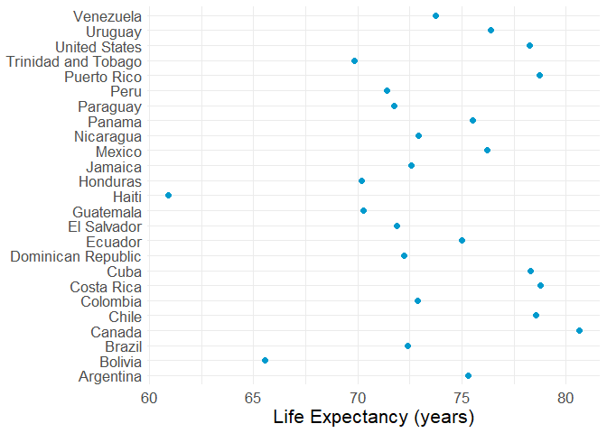
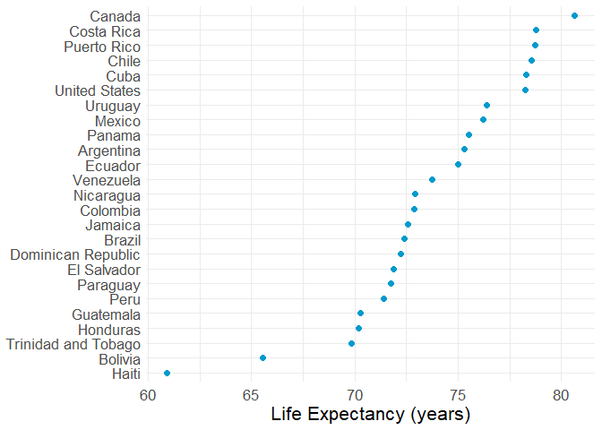
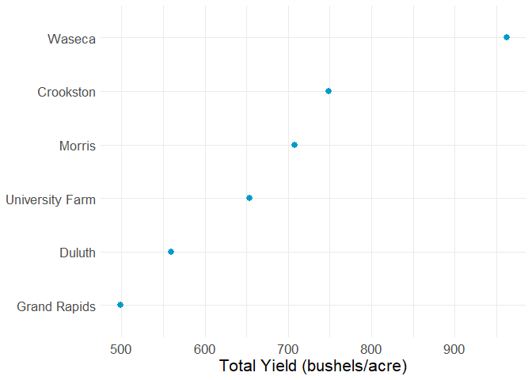
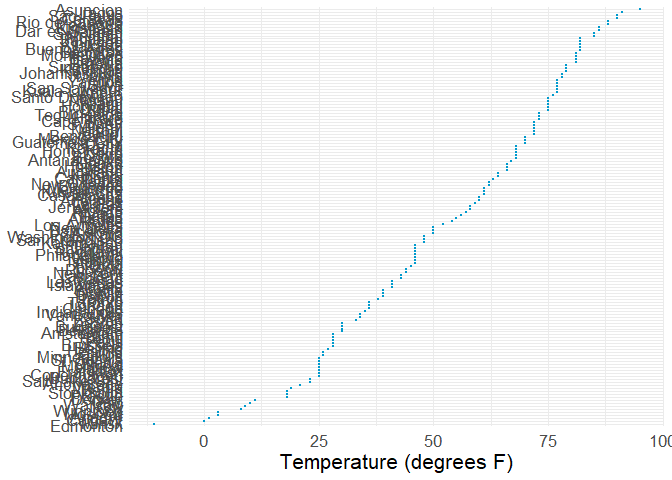
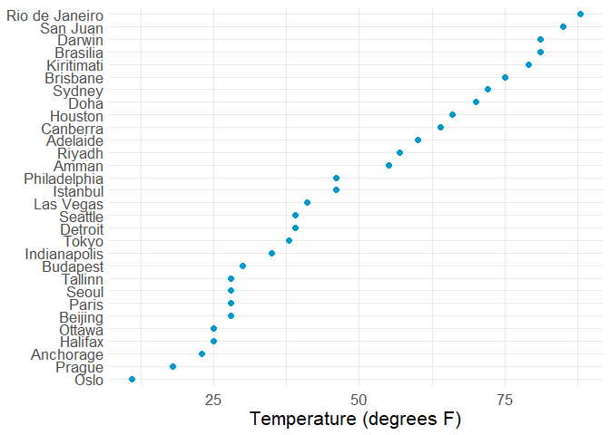
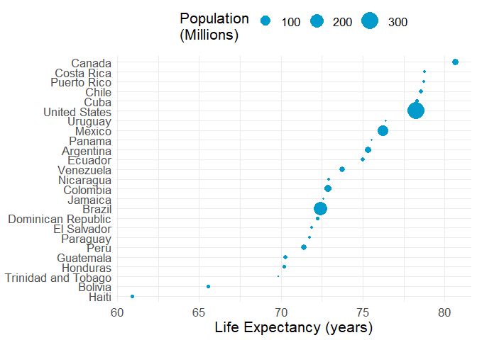

# 1. Dot plots

One of the simplest visualizations of a single numerical variable with a modest number of observations and labels for the observations is a dot plot, or Cleveland dot plot:


```r
# Filtering data
le_am_2007 <- filter(gapminder, 
                     year == 2007,
                     continent == "Americas")
# Setting up the theme
thm <- theme_minimal() +
  theme(text = element_text(size = 16))

# Visualize
ggplot(le_am_2007, aes(x = lifeExp,
                       y = country)) +
  geom_point(color = "deepskyblue3", size = 2) +
  labs(x = "Life Expectancy (years)",
       y = NULL) + 
  thm # Apply the theme
```

<!-- -->

This visualization:

-   Shows the overall distribution of the data

-   Makes it easy to locate the life expectancy of a particular country.

#### Unless there is a natural order to the categories (e.g. months of the year or days of the week) it is usually better to `reorder` to make the plot increasing or decreasing:


```r
ggplot(le_am_2007, aes(x = lifeExp,
                       y = reorder(country, lifeExp))) +
  geom_point(color = "deepskyblue3",
             size = 2) +
  labs(x = "Life Expectancy (years)",
       y = NULL) +
  thm
```

<!-- -->

-   Locating a particular country is a little more difficult.

-   But the shape of the distribution is more apparent.

-   Approximate median and quartiles can be read off easily.

#### Dot plot uses:

Dot plots are particularly appropriate for `interval` data.

-   They often do not show the origin;

-   They focus the viewer's attention on differences.

Dot plots are often very useful for **group summaries** like *totals* or *averages*.

For the barley data, total yield within each site, adding up across all varieties and both years, can be computed as:


```r
b_tot_site <- group_by(barley, site) |>
  summarize(yield = sum(yield))

ggplot(b_tot_site, aes(x = yield,
                       y = site)) +
  geom_point(color = "deepskyblue3",
             size = 2.5) +
  labs(x = "Total Yield (bushels/acre)",
       y = NULL) +
  thm
```

<!-- -->

#### Larger Data Sets

For larger data sets, like the `citytemps` data with 140 observations, over-plotting of labels becomes a problem:


```r
citytemps <- read.table("http://www.stat.uiowa.edu/~luke/data/citytemps.dat", header = TRUE)
ggplot(citytemps, aes(x = temp,
                      y = reorder(city, temp))) +
  geom_point(color = "deepskyblue3",
             size = 0.5) +
  labs(x = "Temperature (degrees F)",
       y = NULL) +
  thm
```

<!-- -->

Reducing to 30 or 40, e.g. by taking a sample or a meaningful subset, can help:


```r
ct1 <- filter(citytemps, temp < 32) |> sample_n(10)
ct2 <- filter(citytemps, temp >= 32) |> sample_n(20)
ctsamp <- bind_rows(ct1, ct2)

ggplot(ctsamp, aes(x = temp,
                   y = reorder(city, temp))) +
  geom_point(color = "deepskyblue3",
             size = 2) +
  labs(x = "Temperature (degrees F)",
       y = NULL) +
  thm
```

<!-- -->

#### Some Variations

The size of the dots can be used to encode an additional numeric variable.

This view uses area to encode population size:

This is sometimes called a **bubble chart**.


```r
ggplot(le_am_2007, aes(x = lifeExp,
                       y = reorder(country, lifeExp),
                       size = pop / 1000000)) +
  geom_point(color = "deepskyblue3") +
  labs(x = "Life Expectancy (years)",
       y = NULL) +
  scale_size_area("Population\n(Millions)", 
                  max_size = 8) +
  thm + theme(legend.position = "top")
```

<!-- -->
